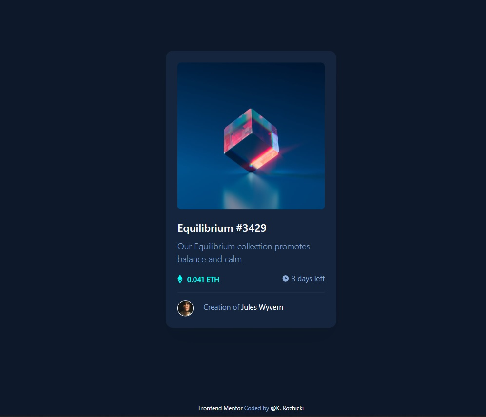

# Frontend Mentor - NFT preview card component solution

https://krzysztofrozbicki.github.io/fem-challenge-04/

This is a solution to the
[NFT preview card component challenge on Frontend Mentor](https://www.frontendmentor.io/challenges/nft-preview-card-component-SbdUL_w0U).
Frontend Mentor challenges help you improve your coding skills by building realistic projects.

## Table of contents

- [Overview](#overview)
  - [The challenge](#the-challenge)
  - [Screenshot](#screenshot)
- [My process](#my-process)
  - [Built with](#built-with)
  - [What I learned](#what-i-learned)
  - [Continued development](#continued-development)
- [Author](#author)
- [Acknowledgments](#acknowledgments)

## Overview

### The challenge

Users should be able to:

- View the optimal layout depending on their device's screen size
- See hover states for interactive elements

### Screenshot

### Links

- Solution URL: (https://github.com/KrzysztofRozbicki/fem-challenge-04/)
- Live Site URL: (https://krzysztofrozbicki.github.io/fem-challenge-04/)

## My process

### Built with

- Semantic HTML5 markup
- CSS custom properties
- Flexbox

### What I learned

Easy and fast project, very developer friendly , you don`t even have to make a @media query for
desktop version. How to make a hover overlay on < img >. How to make easy transitions on hover.

### Continued development

I have noticed that horizontal phone orientation are destroying the layout. Would like to master
that even if design is not telling you that.

## Author

- GitHub - [GitHub](https://github.com/KrzysztofRozbicki)
- Website - [Pogbit](https://www.pogbit.com/)
- Frontend Mentor - [@KrzysztofRozbicki](https://www.frontendmentor.io/profile/KrzysztofRozbicki)

## Acknowledgments

Thanks [GoIt](https://goit.global/pl/) for teaching me all that stuff in fast and easy manner.
